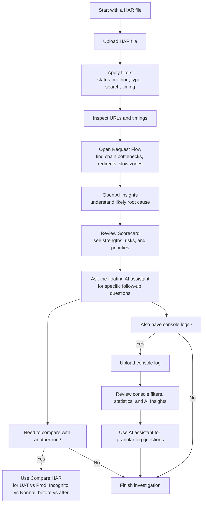

# HAR File Analyzer

HAR File Analyzer is an internal troubleshooting tool for engineers who need to understand what happened during a browser session without manually digging through a raw HAR file line by line.

It combines classic network analysis with guided visuals, AI-assisted diagnosis, HAR-to-HAR comparison, console log analysis, and sanitization workflows so teams can move from "something feels slow or broken" to "this is the likely cause" much faster.

## Who This Is For

- Engineers diagnosing slow pages, failed API calls, redirect loops, auth issues, or payload bloat
- Support and operations teams who need a quick way to explain what is going wrong
- Developers comparing two runs of the same scenario, such as UAT vs production or normal vs incognito
- Anyone who has a HAR file but does not want to read raw JSON manually

## What The Tool Can Do

### HAR analysis
- Upload one or more HAR files and inspect them in separate tabs
- Filter requests by status, method, type, search term, timing, and other useful slices
- Drill into individual requests to inspect timings, payload behavior, and response details
- Review uploads progressively, including large-file chunked upload handling

### Request flow understanding
- Open the Request Flow view to see how requests group together across domains or stages
- Spot bottlenecks, slow hops, redirect chains, and isolated problem zones more quickly than in a flat request list

### Performance scorecard
- Get a plain-language scorecard that highlights what is working well and what needs attention
- Surface issues such as slow responses, errors, missing compression, weak caching, redirects, mixed content, or oversized assets

### AI-assisted diagnosis
- Generate AI Insights for HAR sessions
- Use the floating AI assistant across tabs when you have a very specific question and want a targeted explanation
- Analyze console logs with AI as well, not just HAR requests

### HAR comparison
- Compare two HAR files side by side
- Understand what changed between two runs, including request timing, failed calls, missing requests, or newly introduced regressions

### Console log analysis
- Upload console logs and inspect them in a dedicated analyzer
- Filter by severity and source
- Use AI Insights plus the AI assistant for deeper follow-up questions

### Sanitization
- Scan HAR files for potentially sensitive information before sharing them
- Sanitize tokens, cookies, auth headers, and other risky fields

### Quality-of-life features
- Recent file recall for faster re-analysis
- Export support for filtered views
- Multi-tab workflow so you can keep multiple investigations open at once

## Typical User Workflow

If someone is new to the tool, this is the easiest way to get value from it without feeling overwhelmed:

1. Upload the HAR file.
2. Apply filters to narrow the view to the requests that matter.
3. Inspect the slowest or failing URLs and review their timings.
4. Open Request Flow to understand whether the bottleneck is isolated or part of a larger chain.
5. Open AI Insights to get a likely explanation of what is going wrong.
6. Open the Scorecard to understand the overall quality of the session and the biggest risk areas.
7. Use the floating AI assistant if you have a very specific follow-up question.
8. If a second version of the HAR arrives later, use Compare HAR to see exactly what changed.
9. If you also have browser console output, upload it to the Console Log Analyzer and use AI there too.

## Diagnosis Workflow Diagram



## Architecture At A Glance

The application has a few moving parts:

- Frontend: React + Vite app running on port `3000`
- Backend API: Express + TypeScript service running on port `4000`
- Worker: BullMQ-based worker that processes HAR files and console logs
- MongoDB: stores HAR metadata, entries, and console log data
- Redis: used for job queueing, progress tracking, and pub/sub
- Qdrant: optional, used for AI-related capabilities when available

For local development, MongoDB and Redis are required. Qdrant is optional. The app can still run without Qdrant, but some AI-related capabilities may be reduced depending on configuration.

## Local Development

### Prerequisites

- Node.js installed locally
- MongoDB running locally or reachable from your machine
- Redis running locally or reachable from your machine
- Backend and frontend dependencies installed with `npm install`

### Local service expectations

By default, the backend expects:

- MongoDB at `mongodb://localhost:27017/har-analyzer`
- Redis at `localhost:6379`
- Backend API on `http://localhost:4000`
- Frontend on `http://localhost:3000`

### Install dependencies

From the project root:

```powershell
npm install
```

From the backend folder:

```powershell
cd backend
npm install
```

### Start the frontend

From the project root:

```powershell
npm run dev
```

Expected result:

- Frontend starts on `http://localhost:3000`

### Start the backend API

From `backend`:

```powershell
npm run dev
```

Expected result:

- Backend starts on `http://localhost:4000`
- MongoDB and Redis connect successfully
- Upload and processed directories are created if needed

### Start the worker

For full end-to-end local processing, start the worker too:

```powershell
cd backend
npm run dev:worker
```

Why this matters:

- File uploads are queued
- HAR parsing and console log processing are completed by the worker
- Without the worker, uploads may appear to succeed but stay stuck in processing

### Local AI notes

AI features depend on backend-side AI configuration. In this codebase, Oracle Code Assist and related AI settings are commonly provided via `backend/.env`. If AI features are unavailable, the rest of the analysis workflow still remains useful.

## Environment Variables

### Frontend

For local development, the frontend will fall back to `http://localhost:4000` if `VITE_API_URL` or `VITE_BACKEND_URL` are not set.

For VM builds, `.env.production` should point to the VM backend:

```env
VITE_API_URL=http://10.65.39.163:4000
VITE_BACKEND_URL=http://10.65.39.163:4000
```

### Backend

Useful backend variables include:

```env
PORT=4000
MONGODB_URL=mongodb://localhost:27017/har-analyzer
REDIS_HOST=localhost
REDIS_PORT=6379
UPLOAD_DIR=./uploads
PROCESSED_DIR=./processed

# AI-related variables
OCA_BASE_URL=<your Oracle Code Assist base URL>
OCA_MODEL=oca/gpt-5.4
OCA_TOKEN=<your token>

# Optional
QDRANT_URL=http://localhost:6333
```

For VM-specific proxy and token behavior, read [VM_RUNBOOK.md](./VM_RUNBOOK.md).

## Running The Deployed Tool

Once deployed and reachable over VPN, users access the tool at:

`http://10.65.39.163:3000`

The DNS hostname is also supported:

`http://celvpvm05798.us.oracle.com:3000`

Both frontend origins are allowed by the backend CORS configuration.

## VM Deployment

This section captures the current real-world deployment flow, including the constraints that make the VM different from a normal server.

### Important reality of the VM

- Node.js is installed on the VM
- The VM is not a place where we rely on `npm install`
- Frontend assets must be built on a local machine first
- MongoDB and Redis are already configured on the VM
- PM2 is used to keep the services running

### Current deployed processes

Typical PM2 processes on the VM:

- `har-backend`
- `har-frontend`
- `har-worker`

The frontend is served on port `3000`, the backend on `4000`, and the worker handles background processing.

### Important hostname note

There is a hostname mismatch in the notes:

- One note mentions `ssh oracle@celvpvm05774.us.oracle.com`
- The runbook and `scp` examples point to `celvpvm05798.us.oracle.com`

Before deploying, confirm which VM hostname is currently correct. Do not assume both are interchangeable.

### Frontend deployment flow

Because the VM cannot reliably install frontend dependencies, the frontend is built locally and only the build output is copied across.

On your local machine:

```powershell
npm run build
```

Then copy the built frontend to the VM:

```powershell
scp -r dist/* oracle@celvpvm05798.us.oracle.com:/refresh/home/Downloads/har-analyzer/dist/
```

### Backend deployment flow

After your local changes are pushed to the Git repository, the VM still needs the latest code pulled before the backend rebuild takes effect.

On the VM:

```bash
cd ~/Downloads/har-analyzer
git pull origin main

cd backend
npm run build
```

### Restarting services with PM2

After the new frontend `dist` files are copied and the latest backend code is pulled and built, restart the PM2 services so users receive the updated version.

Common commands:

```bash
pm2 status
pm2 restart har-backend --update-env
pm2 restart har-frontend --update-env
```

Worker handling is more sensitive than a normal restart. For the worker-specific recreation flow and the reason behind it, use [VM_RUNBOOK.md](./VM_RUNBOOK.md).

### Recommended VM deployment checklist

1. Build the frontend locally.
2. Copy the frontend `dist` output to the VM.
3. SSH into the VM.
4. Run `git pull origin main`.
5. Build the backend on the VM with `npm run build`.
6. Restart the relevant PM2 processes.
7. Verify the tool loads through the VPN URL.

## Why The VM Runbook Matters

The VM deployment has a few pain points that are easy to forget if they are not written down:

- Frontend build artifacts must come from local, not from the VM
- Proxy configuration affects AI connectivity
- OCA tokens expire and need refresh
- Worker restarts are not entirely straightforward
- A wrong frontend build can still load, but silently point to the wrong backend

That is why [VM_RUNBOOK.md](./VM_RUNBOOK.md) should be treated as the operational source of truth for deployment quirks, recovery steps, and deeper troubleshooting.

## Known Limitations And Risks

These are worth documenting so future engineers are not surprised by them.

### Domain cache memory usage risk

The domain cache in HAR processing uses full URLs as keys. Large HAR files with many unique URLs, especially signed URLs, can reduce cache reuse and push memory usage up by tens of megabytes.

Potential impact:

- Higher worker memory pressure
- Possible out-of-memory behavior in extreme cases

### Streaming backpressure is not explicitly configured

The transform stream used during HAR parsing does not currently define a `highWaterMark`.

Under heavy load or slow database inserts:

- Parsed objects may accumulate in memory
- Memory usage can rise more than expected

### SSE streaming edge case

Server-Sent Events used for streaming chat and insight responses may behave badly if the upstream AI service returns a null or invalid stream.

Potential impact:

- Hung requests
- Partial or incomplete responses

## Troubleshooting Quick Notes

### The UI loads but uploads never finish

Make sure the backend worker is running. The frontend and API alone are not enough for full processing.

### The backend starts but AI does not work

Check:

- `backend/.env` contains the required AI variables
- Proxy settings are correct on the VM if you are using Oracle-hosted AI
- The token has not expired

### A new deployment does not seem to take effect

Most often, one of these steps was missed:

- Frontend was not rebuilt locally
- `dist` was not copied to the VM
- `git pull origin main` was skipped on the VM
- PM2 processes were not restarted

### The app works locally but not on the VM

Use [VM_RUNBOOK.md](./VM_RUNBOOK.md) first. It contains the real deployment workarounds, proxy setup, PM2 notes, and recovery commands.

## Repository Structure

```text
HAR-File-Analyser/
|-- src/            # Frontend application
|-- backend/        # Backend API and worker
|-- dist/           # Frontend build output
|-- docs/           # Supporting documentation
|-- VM_RUNBOOK.md   # VM deployment and troubleshooting details
```

## Final Notes

This tool is most useful when used as a guided investigation workspace, not just a file viewer.

If you are unsure where to start:

1. Upload the HAR file.
2. Filter down to the suspicious requests.
3. Open Request Flow.
4. Read AI Insights.
5. Sanity-check the Scorecard.
6. Ask the AI assistant the last-mile question.

That sequence tends to get engineers to a useful answer quickly without requiring them to know every tab in advance.
