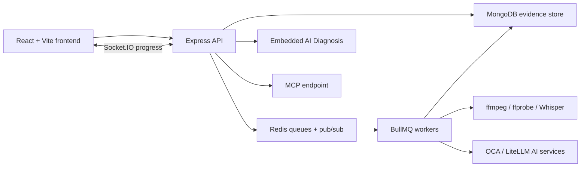

# Support Analyzer Workbench

Support Analyzer Workbench is an internal evidence analysis workspace for support engineers. It started as a HAR analyzer, but now handles broader customer evidence: HAR files, console logs, PDFs, Word/PowerPoint documents, images, archives, and screen-recording videos.

The goal is to shorten the time between "the customer gave us files" and "the engineer has a defensible support handoff with cited evidence."

## Core Capabilities

- **HAR analysis:** inspect requests, timings, redirects, payloads, failures, request flow, scorecards, sanitization, and HAR-to-HAR comparisons.
- **Console log analysis:** parse and filter browser/server logs, group issues, and use AI diagnosis with exact log context.
- **Universal file intake:** accept PDFs, DOCX/PPTX, images, ZIPs, CSVs, configs, and other support artifacts with metadata, preview, and AI-ready handoff context.
- **AI Diagnosis integration:** sync uploaded evidence into the embedded Support Workbench AI Diagnosis experience.
- **Video evidence analysis:** process Zoom/session recordings into media playback, scene-change keyframes, AI visual findings, sampled audio transcript, audio/visual correlation, and an engineer handoff.
- **MCP access:** expose curated analyzer tools to approved MCP-capable LLM clients for evidence upload, deterministic search/inspection, AI Diagnosis, reporting, and workbench deep links.
- **Large file handling:** chunked uploads, resumable-style progress, video-aware upload behavior, and backend queue processing via workers.

## Typical Support Workflow

1. Upload the evidence bundle or individual files.
2. Review each file in Visual Analysis.
3. For HARs, inspect failed/slow requests, request flow, scorecard, and comparison views.
4. For logs, filter errors and inspect exact lines.
5. For videos, start Video Evidence Analysis and review keyframes as soon as they appear.
6. Let AI Diagnosis reason across the available evidence.
7. Copy or download the Engineer Handoff for SR notes or escalation.
8. Use MCP when an approved LLM client needs to drive the same evidence workflow remotely.

## Video Evidence Analysis

Video support is designed for customer Zoom/session recordings where the spoken summary alone is not enough. The analyzer focuses on fast first value instead of waiting for a full one-hour recording to finish.

### What the video analyzer does

- Streams the uploaded recording in the browser.
- Extracts key screens using scene-change detection instead of fixed intervals.
- Places extracted keyframes on the media timeline.
- Lets engineers click a frame or evidence card to seek the media player to that timestamp.
- Runs AI visual review over selected frames.
- Samples audio around visual moments for the first transcript pass.
- Correlates transcript segments with visual keyframes.
- Builds an Engineer Handoff with confirmed facts, gaps, next steps, evidence cards, and processing timings.
- Shows a subtle Processing Transparency strip so engineers know what is available now and what is still running.

### Fast-first behavior

By default, long recordings do not wait for full-session transcription before returning useful evidence. The worker:

1. reads metadata,
2. selects non-redundant key screens,
3. publishes visual findings,
4. samples audio around key moments,
5. transcribes sampled audio,
6. correlates audio and visual evidence,
7. builds the final support handoff.

The UI remains transparent during long runs. It reports the current phase, elapsed runtime, available results, still-running stages, and a calm expectation note.

## Architecture



### Runtime pieces

- Frontend: React + Vite, default port `3000`
- Backend API: Express + TypeScript, default port `4000`
- Worker: BullMQ worker for HAR/log/video/background processing
- MongoDB: metadata, parsed entries, evidence, video state, transcripts
- Redis: queues, progress metadata, pub/sub
- Qdrant: optional AI/vector support
- Support Workbench: separate local service for embedded AI Diagnosis
- MCP server: remote tool endpoint exposed by the backend

## Local Development

### Prerequisites

- Node.js
- Rancher Desktop, Docker Desktop, or another local container runtime
- MongoDB
- Redis
- Optional: Qdrant for AI/vector features
- Optional for video: `ffmpeg` and `ffprobe`
- Optional for local transcription fallback: Python + OpenAI Whisper

### Local infrastructure with Rancher Desktop

For a new local machine, the simplest setup is to run MongoDB, Redis, and optional Qdrant as containers through Rancher Desktop.

In Rancher Desktop, use either:

- **dockerd/moby** with the `docker` CLI, or
- **containerd** with the `nerdctl` CLI.

The commands below use `docker`. If your Rancher Desktop installation exposes `nerdctl` instead, replace `docker` with `nerdctl`.

Create a shared network and persistent volumes:

```powershell
docker network create support-analyzer-net
docker volume create support-analyzer-mongo
docker volume create support-analyzer-redis
docker volume create support-analyzer-qdrant
```

Start MongoDB:

```powershell
docker run -d `
  --name support-analyzer-mongo `
  --network support-analyzer-net `
  -p 27017:27017 `
  -v support-analyzer-mongo:/data/db `
  mongo:7
```

Start Redis with append-only persistence:

```powershell
docker run -d `
  --name support-analyzer-redis `
  --network support-analyzer-net `
  -p 6379:6379 `
  -v support-analyzer-redis:/data `
  redis:7-alpine redis-server --appendonly yes
```

Optional: start Qdrant for vector/AI features:

```powershell
docker run -d `
  --name support-analyzer-qdrant `
  --network support-analyzer-net `
  -p 6333:6333 `
  -v support-analyzer-qdrant:/qdrant/storage `
  qdrant/qdrant:latest
```

Verify containers are running:

```powershell
docker ps --filter "name=support-analyzer"
```

Verify MongoDB:

```powershell
docker exec support-analyzer-mongo mongosh --eval "db.runCommand({ ping: 1 })"
Test-NetConnection 127.0.0.1 -Port 27017
```

Verify Redis:

```powershell
docker exec support-analyzer-redis redis-cli ping
Test-NetConnection 127.0.0.1 -Port 6379
```

Verify Qdrant if enabled:

```powershell
Invoke-RestMethod http://127.0.0.1:6333/collections
```

Create `backend/.env` for the Rancher Desktop setup:

```env
PORT=4000
MONGODB_URL=mongodb://127.0.0.1:27017/har-analyzer
REDIS_HOST=127.0.0.1
REDIS_PORT=6379
UPLOAD_DIR=./uploads
PROCESSED_DIR=./processed
QDRANT_URL=http://127.0.0.1:6333

VIDEO_FAST_MODE_ENABLED=true
VIDEO_FAST_TRANSCRIPT_MAX_SECONDS=180
VIDEO_FAST_TRANSCRIPT_WINDOW_SECONDS=45
VIDEO_SCENE_DETECT_FPS=1
VIDEO_TRANSCRIPT_CACHE_ENABLED=true
```

If you do not run Qdrant locally, leave `QDRANT_URL` unset. The backend treats Qdrant as optional.

Start the application after MongoDB and Redis are healthy:

```powershell
npm run dev:all
```

Useful infrastructure commands:

```powershell
# Stop local infra
docker stop support-analyzer-mongo support-analyzer-redis support-analyzer-qdrant

# Start it again
docker start support-analyzer-mongo support-analyzer-redis support-analyzer-qdrant

# See logs
docker logs support-analyzer-mongo --tail 80
docker logs support-analyzer-redis --tail 80
docker logs support-analyzer-qdrant --tail 80

# Remove containers but keep data volumes
docker rm -f support-analyzer-mongo support-analyzer-redis support-analyzer-qdrant

# Remove data volumes only when you intentionally want a clean database
docker volume rm support-analyzer-mongo support-analyzer-redis support-analyzer-qdrant
```

Troubleshooting:

- If the backend cannot connect to MongoDB, check `Test-NetConnection 127.0.0.1 -Port 27017` and confirm `MONGODB_URL` uses `127.0.0.1`, not a container-only hostname.
- If Redis connection fails, confirm `docker exec support-analyzer-redis redis-cli ping` returns `PONG`.
- If ports are already in use, stop the conflicting local service or remap the container port and update `backend/.env`.
- If Rancher Desktop is using Kubernetes-only mode and no Docker-compatible CLI is available, enable the Docker-compatible engine or use `nerdctl` with the same image, port, and volume options.
- If uploads stay stuck in processing, the backend worker is not running or cannot reach Redis.

Install frontend dependencies:

```powershell
npm install
```

Install backend dependencies:

```powershell
cd backend
npm install
```

### Start everything

From the repository root:

```powershell
npm run dev:all
```

This starts:

- HAR/Workbench frontend on `http://localhost:3000`
- backend API on `http://localhost:4000`
- backend worker
- local Support Workbench frontend/backend when a checkout is detected

By default, `dev:all` looks for Support Workbench at:

```text
C:\Users\ssawane\Documents\Work\claude-code
```

Override the path if needed:

```powershell
$env:SUPPORT_WORKBENCH_DIR="C:\Users\ssawane\Documents\Work\claude-code"
npm run dev:all
```

### Start services separately

Frontend:

```powershell
npm run dev
```

Backend API:

```powershell
cd backend
npm run dev
```

Worker:

```powershell
cd backend
npm run dev:worker
```

AI Diagnosis is served by the separate Support Workbench repo. If it is not running, Visual Analysis still opens, but embedded AI Diagnosis requests under `/api/support-workbench/*` return a service-unavailable response.

## Environment Variables

### Frontend

Local defaults are usually enough:

```env
VITE_API_URL=http://localhost:4000
VITE_BACKEND_URL=http://localhost:4000
VITE_WS_URL=http://localhost:4000
```

For the current VM deployment:

```env
VITE_API_URL=http://10.65.39.163:4000
VITE_BACKEND_URL=http://10.65.39.163:4000
VITE_WS_URL=http://10.65.39.163:4000
```

### Backend

Common backend settings:

```env
PORT=4000
MONGODB_URL=mongodb://localhost:27017/har-analyzer
REDIS_HOST=localhost
REDIS_PORT=6379
UPLOAD_DIR=./uploads
PROCESSED_DIR=./processed
QDRANT_URL=http://localhost:6333
```

AI settings:

```env
OCA_BASE_URL=<company-approved OCA or LiteLLM base URL>
OCA_MODEL=oca/gpt-5.4
OCA_TOKEN=<token>
LITELLM_BASE_URL=<optional; defaults to OCA_BASE_URL>
LITELLM_API_KEY=<optional; defaults to OCA_TOKEN>
```

Video/audio settings:

```env
VIDEO_FAST_MODE_ENABLED=true
VIDEO_FAST_TRANSCRIPT_MAX_SECONDS=180
VIDEO_FAST_TRANSCRIPT_WINDOW_SECONDS=45
VIDEO_SCENE_DETECT_FPS=1
VIDEO_TRANSCRIPTION_PROVIDER=auto
VIDEO_TRANSCRIPTION_AUDIO_FORMAT=mp3
VIDEO_TRANSCRIPTION_MAX_AUDIO_BYTES=52428800
VIDEO_TRANSCRIPT_CACHE_ENABLED=true
FFMPEG_PATH=<optional absolute path to ffmpeg>
FFPROBE_PATH=<optional absolute path to ffprobe>
```

Remote transcription settings:

```env
LITELLM_TRANSCRIPTION_URL=<optional dedicated /v1/audio/transcriptions endpoint>
LITELLM_TRANSCRIPTION_MODEL=whisper
OCA_TRANSCRIPTION_URL=<optional fallback transcription endpoint>
OCA_TRANSCRIPTION_TOKEN=<optional fallback token>
OCA_TRANSCRIPTION_MODEL=oca/transcribe
OCA_CHAT_AUDIO_ENABLED=false
```

Local Whisper fallback:

```env
VIDEO_LOCAL_WHISPER_ENABLED=false
PYTHON_PATH=<optional Python executable>
WHISPER_COMMAND=whisper
WHISPER_FAST_MODEL=tiny.en
WHISPER_MODEL=base
WHISPER_LANGUAGE=en
VIDEO_LOCAL_WHISPER_TIMEOUT_MS=1200000
```

Install local Whisper only on machines that need offline transcription:

```bash
pip install -U openai-whisper
whisper --help
```

Keep `OCA_CHAT_AUDIO_ENABLED=false` unless the configured OCA chat endpoint is confirmed to accept audio input. Some OpenAI-compatible chat gateways reject `input_audio` before the model sees it.

## MCP Service

The MCP service lets an approved LLM client call Support Analyzer tools remotely. In normal hosted usage, configure the client with the remote MCP URL exposed by the backend. Do not point clients at frontend URLs.

Example hosted endpoint:

```text
http://10.65.39.163:4100/mcp
```

Example client config:

```json
{
  "mcpServers": {
    "support-analyzer-workbench": {
      "url": "http://10.65.39.163:4100/mcp"
    }
  }
}
```

Important upload behavior:

- `filePaths` only works for files visible to the MCP server filesystem.
- Remote Windows paths such as `C:\Users\...` are not visible to the Linux-hosted MCP server.
- Remote clients should use inline upload with `files[].contentBase64`, or a client bridge that reads local bytes and sends them to the MCP server.

Large MCP uploads are supported through the server-side upload path, but client bridges still need to stream/read local files properly.

## Verification

Frontend:

```powershell
npm test
npm run build
```

Focused video UI tests:

```powershell
npm test -- src/components/VideoEvidenceAnalyzer.test.tsx
```

Backend:

```powershell
cd backend
npm test
npm run build
```

Focused video backend tests:

```powershell
cd backend
npm test -- src/workers/videoProcessor.test.ts src/routes/videoRoutes.test.ts
```

## VM Deployment

Current hosted frontend URLs:

```text
http://10.65.39.163:3000
http://celvpvm05798.us.oracle.com:3000
```

The VM uses PM2 for long-running services. Typical processes:

- `har-backend`
- `har-frontend`
- `har-worker`

Frontend assets are built locally and copied to the VM:

```powershell
npm run build
scp -r dist/* oracle@celvpvm05798.us.oracle.com:/refresh/home/Downloads/har-analyzer/dist/
```

Backend code is pulled and built on the VM:

```bash
cd ~/Downloads/har-analyzer
git pull origin main
cd backend
npm run build
```

Restart services:

```bash
pm2 status
pm2 restart har-backend --update-env
pm2 restart har-frontend --update-env
pm2 restart har-worker --update-env
```

For VM-specific proxy, token, and worker recovery details, use `VM_RUNBOOK.md`.

## Repository Layout

```text
HAR-File-Analyser/
|-- src/                  # React frontend
|-- backend/              # Express API, MCP service, workers
|-- docs/                 # Plans and product notes
|-- scripts/              # Local development helpers
|-- dist/                 # Frontend build output
|-- VM_RUNBOOK.md         # Deployment and recovery notes
```

## Known Product Constraints

- First-pass video analysis is optimized for speed, not exhaustive full-session transcription.
- Full local Whisper transcription on CPU can be slow for long Zoom recordings.
- Video analysis needs `ffmpeg` and `ffprobe` on the backend host for best results.
- MCP `filePaths` are server-side paths, not client-local paths.
- AI features depend on company-approved OCA/LiteLLM configuration and token freshness.
- MongoDB and Redis are required for the full workbench flow.

## Security Notes

- Do not commit tokens, customer evidence, HAR files, video recordings, or generated runtime artifacts.
- Sanitize customer-sensitive HAR data before broad sharing.
- Treat AI output as evidence-assisted diagnosis, not a replacement for engineer review.
- Prefer exact analyzer search/inspection before broad AI conclusions.
